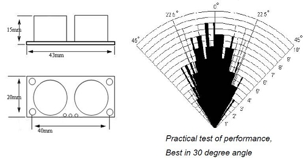
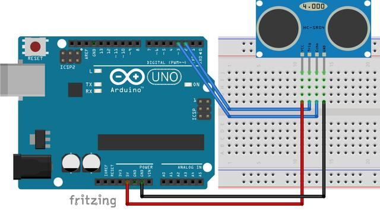

# HC-SR04 Ultrasonic Uensor Library for Arduino



## Implementation



```C++
#include <HCSR04.h>

const byte TRIGGER_PIN = 8;
const byte ECHO_PIN = 9;
HCSR04 sensor(TRIGGER_PIN, ECHO_PIN);

void setup() {
    Serial.begin(9600);
}

void loop() {
    Serial.println(sensor.distance()); // display distance (cm) on serial
    delay(500);
}
```

> If you want to use multiple sensors
> 

```C++
#include <HCSR04.h>

const byte TRIGGER_PIN = 2;
const byte ECHO_PINS [6] = {5, 6, 7, 8, 9, 10};
const byte NUM_SENSORS = 6;
HCSR04 sensors(TRIGGER_PIN, ECHO_PINS, NUM_SENSORS);

void setup() {
    Serial.begin(9600);
}

void loop() {
    for (int i = 0; i < 6; i++)
        Serial.println(sensors.distance(i)); // display distance (cm) on serial for sensors 1 to 6
    delay(500);
}
```

## Installation

Download the ZIP file and install the library using the [standard Arduino library installation procedure](http://arduino.cc/en/Guide/Libraries)

## [License](https://github.com/gamegine/HCSR04-ultrasonic-sensor-lib/blob/master/LICENSE)

[MIT License](https://github.com/gamegine/HCSR04-ultrasonic-sensor-lib/blob/master/LICENSE)
